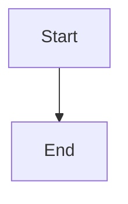

---
title: "Obsidian Core Structures"
aliases:
  - "Obsidian Core Sample"
tags:
  - obsidian
  - core
publish: false
draft: true
rating: 4.5
created: 2026-02-02
updated: 2026-02-02T10:30:00
link: "[[Internal Link]]"
related:
  - "[[Folder/Note]]"
  - "[[Folder/Note#Section]]"
cssclass: "obsidian-sample"
---

# Obsidian Core Structures

## Inline properties
status:: active
priority:: 2
estimate:: 3h
owner:: [[People/Alice]]
reviewers:: [[People/Bob]], [[People/Carol]]
dataset:: [one, two, three]

## Links and references
- [[Internal Link]]
- [[Internal Link|Alias text]]
- [[Internal Link#Heading]]
- [[Internal Link#^block-ref]]
- ((^block-ref))
- [External link](https://example.com)

## Block IDs and references
This paragraph has a block id. ^block-ref

## Embeds (transclusions)
![[Internal Link]]
![[Internal Link#Heading]]
![[Internal Link#^block-ref]]
![[Image.png|200x120]]
![[Audio.ogg]]
![[Document.pdf]]

## Tags
Inline tag: #meeting
Nested tag: #project/phase

## Lists and tasks
- Bullet item
- Nested list
  - Child item

1. Ordered item
2. Ordered item

- [ ] Core task
- [x] Completed task

## Callouts
> [!info] Callout title
> Callouts can contain **Markdown**, links, and embeds.

> [!warning]- Folded callout
> Collapsed by default when the callout is folded.

## Comments
%% This is a block comment and is ignored by Obsidian. %%

## Tables
| Name | Value | Note |
| --- | --- | --- |
| Alpha | 1 | [[Internal Link]] |
| Beta | 2 | ![[Image.png|50]] |

## Code
Inline `code`.

```ts
export const answer = 42;
```

## Math
Inline math: $e^{2i\pi} = 1$.

$$
\int_0^1 x^2 dx = \frac{1}{3}
$$

## Footnotes
A footnote reference.[^1]

[^1]: Footnote text.

## Mermaid


## Query block (core)
```query
path: "Projects" tag:#project
```

## Inline HTML
<span class="custom">HTML inline content</span>

## Core file formats

### JSON Canvas (.canvas)
```json
{
  "nodes": [
    {
      "id": "n1",
      "type": "text",
      "x": 0,
      "y": 0,
      "width": 300,
      "height": 100,
      "text": "Canvas text node"
    }
  ],
  "edges": []
}
```

### Bases (.base)
```base
filters:
  and:
    - file.hasTag("example")
views:
  - type: table
    name: "Example table"
    limit: 10
    order:
      - file.name
```
